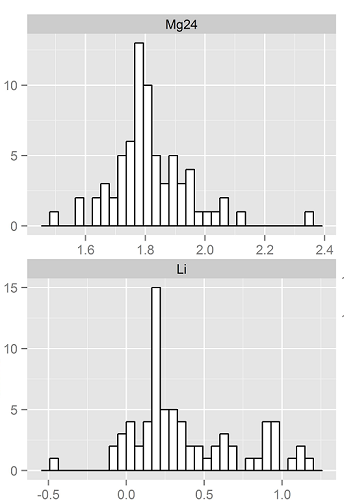

## Otolith Microchemical Analysis
<div class="black">
 Used to identify stocks and life histrory of fish 
  </div> 


<div class="black">
Age and Growth Microchemistry Projects:
 </div> 
 
- P. Cod
- Grenadier
- Eulachon

# Exploratory Data Analysis
## Summarize with Visual Methods 
<div class="columns-2">
 

- Check distribution 
- Find outliers
- Log-transform data
</div>

## More Plots
 <div class="columns-2">
 
 
 </div>

## Static Plot


## Interactive Plot
```{r,echo=FALSE, cache=TRUE}
library(ggvis)
library(shiny)
gr<-read.csv("C:\\Users\\Irina\\Desktop\\shinyapp_final\\1.shinyprez\\gr_kali.csv", header=TRUE)
```
```{r,echo=FALSE}
gr %>% ggvis(x = ~Li) %>%
    layer_densities(fill:= "blue",
      adjust = input_slider(.1, 2, value = 1, step = .1, label = "Bandwidth adjustment"),
      kernel = input_select(
        c("Gaussian" = "gaussian",
          "Epanechnikov" = "epanechnikov",
          "Rectangular" = "rectangular",
          "Triangular" = "triangular",
          "Biweight" = "biweight",
          "Cosine" = "cosine",
          "Optcosine" = "optcosine"),
        label = "Kernel")
    )

```

## Correlation Matricies
<div class="columns-2">


</div>

# 'Ageing Criteria' Analysis
## Work with Multiple Individual Plots
- Use faceted plots to visualize over 200 transect lines
- Use spline to fit a curve 


## Work with Multiple Variables
- Combine variables from different data sets
- Transform some but not others or combine different scales


## Plots with Transperent Background


## Agreement


# Canonical Discriminant Analysis
## CDA Plots
<div class="columns-2">


</div>

## Combination CDA plot


# Work in progress
## Reproducible Research 
<div class="columns-2">
- Single document contains analysis, code, and results
- Publishing to web or word document
- Automatically regenerate documents when assumptions change
- Eliminate errors that happens when copying results into documents


 </div>

## Building Interactive Web Application
 - Accessible to all users 
 
https://elemental.shinyapps.io/shinyAPPscatter
https://elemental.shinyapps.io/shinyAPPbox/
https://elemental.shinyapps.io/shinyAPPcda/


